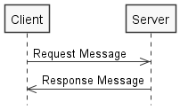
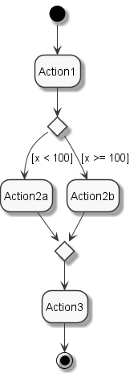

# Diagrams as code
[](https://gitter.im/diagramsascode/community?utm_source=badge&utm_medium=badge&utm_campaign=pr-badge)

*Diagrams as code* is a term used for storing the source of a diagram image as a text file.
Examples are architecture diagrams, or diagrams showing a system's behavior or design.
A generator tool like [PlantUML](https://plantuml.com/) then generates an image from the text, and automatically layouts it. According to the [ThoughtWorks Technology Radar](https://www.thoughtworks.com/radar/techniques/diagrams-as-code), a key benefit is that 
you can use version control on the text files.

The diagrams as code project presented here has additional advantages.

By representing the diagrams as models in Java source code, 
you can automatically check if the generated diagrams are modeled correctly.
And you get better syntax highlighting and auto-completion, compared to solutions like PlantUML.

# Getting started
Diagrams as code is available on Maven Central.

If you are using Maven, include the following in your POM:

``` xml
<dependency>
  <groupId>org.diagramsascode</groupId>
  <artifactId>diagramsascode-image</artifactId>
  <version>0.1.2</version>
</dependency>
```

If you are using Gradle, include the following in your build.gradle:

```
implementation 'org.diagramsascode:diagramsascode-image:0.1.2'
```

The jar files are also available in 'Releases'.

At least Java 8 is required to run diagrams as code.

# Generate diagram images
## Generate a sequence diagram image
The following sequence diagram image has been generated by the source code below:



Here's the code (Java 8 syntax [here](https://github.com/diagramsascode/diagramsascode/blob/main/diagramsascode-image/src/test/java/org/diagramsascode/image/SequenceDiagramImageTest.java)):

``` java
// Create the participants (that exchange messages)
var participant1  = new Participant("Client");
var participant2  = new Participant("Server");

// Create the request and response message
var message1 = new Message(participant1, participant2, "Request Message");
var message2 = new Message(participant2, participant1, "Response Message");

// Build the diagram
var diagram = Diagram.builder()
  .withNodes(participant1, participant2)
  .withEdges(message1, message2)
  .withConstraints(new SequenceDiagramConstraints())
  .build();
	
// Create the image of the diagram and write it to a PNG file.
var outputFile = File.createTempFile("sequence", ".png");
SequenceDiagramImage.of(diagram).writeToPngFile(outputFile);

System.out.println("Sequence diagram written to: " + outputFile);
```
    
## Generate an activity diagram image
The following activity diagram image has been generated by the source code below:



Here's the code (Java 8 syntax [here](https://github.com/diagramsascode/diagramsascode/blob/main/diagramsascode-image/src/test/java/org/diagramsascode/image/ActivityDiagramImageTest.java)):

``` java
// Create the initial and final node (to define where the flow starts and ends)
var initialNode = new InitialNode();
var finalNode = new FinalNode();
	
// Create the decision and merge node (to split the flow and merge it back together)
var decisionNode = new DecisionNode();
var mergeNode = new MergeNode();
	
// Create actions (for the flow steps)
var action1 = new Action("Action1");
var action2a = new Action("Action2a");
var action2b = new Action("Action2b");
var action3 = new Action("Action3");

// Connect the nodes with control flow edges.
// If they originate from a decision node, the third constructor parameter
// specifies the decision's condition (e.g. "x < 100")
var edge1 = new ControlFlow(initialNode, action1);
var edge2 = new ControlFlow(action1, decisionNode);
var edge3_a = new ControlFlow(decisionNode, action2a, "x < 100");
var edge3_b = new ControlFlow(decisionNode, action2b, "x >= 100");
var edge4_a = new ControlFlow(action2a, mergeNode);
var edge4_b = new ControlFlow(action2b, mergeNode);
var edge5 = new ControlFlow(mergeNode, action3);
var edge6 = new ControlFlow(action3, finalNode);

// Build the diagram
var diagram = Diagram.builder()
  .withNodes(initialNode, finalNode, decisionNode, mergeNode, action1, action2a, action2b, action3)
  .withEdges(edge1, edge2, edge3_a, edge3_b, edge4_a, edge4_b, edge5, edge6)
  .withConstraints(new ActivityDiagramConstraints())
  .build();

// Create the image of the diagram and write it to a PNG file.
var outputFile = File.createTempFile("activity", ".png");
ActivityDiagramImage.of(diagram).writeToPngFile(outputFile);

System.out.println("Activity diagram written to: " + outputFile);
```

# Constraints
## Sequence diagram constraints
A sequence diagram has to take the following constraints into account:

* Only sequence diagram nodes are shown on the diagram, i.e. participants
* Only sequence diagram edges are shown on the diagram, i.e. messages
* Each participant has a name

These constraints are defined in the [SequenceDiagramConstraints](https://github.com/diagramsascode/diagramsascode/blob/main/diagramsascode-sequence/src/main/java/org/diagramsascode/sequence/constraint/SequenceDiagramConstraints.java) instance. 

## Activity diagram constraints
An activity diagram has to take the following constraints into account:

* Only activity diagram nodes are shown on the diagram, i.e. initial/final nodes, decision/merge nodes, and actions
* Only activity diagram edges are shown on the diagram, i.e. control flow
* Each action has a name
* Each decision node has one incoming edge
* Each decision node has at least one outgoing edge
* Each merge node has at least one incoming edge
* Each merge node has one outgoing edge
* An initial node has no incoming edges
* A final node has no outgoing edges

These constraints are defined in the [ActivityDiagramConstraints](https://github.com/diagramsascode/diagramsascode/blob/main/diagramsascode-activity/src/main/java/org/diagramsascode/activity/constraint/ActivityDiagramConstraints.java) instance.

## General notes on constraints
The constraints are validated implicitly when you create an `ImageSource` instance.
You can also validate them explicitly by calling `diagram.validate()`.

You can omit validating constraints by skipping the part `.withConstraints(...)` part when building the diagram. 
While this is not recommended in general since it allows building invalid diagrams, it may be useful for prototyping.

You can enforce more or less strict constraints by implementing the `DiagramConstraints` interface and provide your own constraints,
or reuse existing ones.

# Sub projects
The diagrams as code project consists of the following sub projects:
* **diagramsascode-core**: defines the core modeling elements, like nodes, edges and constraints. It is not intended to be used directly. Instead, it needs to be extended for each diagram type to be generated.
* **diagramsascode-sequence**: builds on core to represent UML sequence diagrams with participants and messages. Adds sequence diagram specific constraints.
* **diagramsascode-activity**: builds on core to represent UML activity diagrams with initial/final nodes, actions, decision/merge nodes and control flow. Adds activity diagram specific constraints.
* **diagramsascode-image**: enables you to generate automatically layouted images for the diagrams.
 


