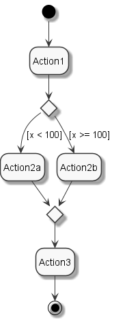

# diagrams as code - image
[](https://travis-ci.com/diagramsascode/diagramsascode)
[](https://gitter.im/diagramsascode/community?utm_source=badge&utm_medium=badge&utm_campaign=pr-badge)

Generate valid diagram images from source code.

## How to build an activity diagram
The following activity diagram has been generated from source code:



The full black circle is called *initial node*. It starts the flow. The black circle with the white circle around it is called *final node*. It ends the flow.

The *actions* Action1, Action2a, Action2b and Action3 are the steps of the flow.

The white diamonds are called *decision node* and *merge node*. They split and merge the flow.

The edges between the nodes are called *control flow*. They define the order of steps. The outgoing edges of a decision node define the *guard condition* that decides which branch to follow.

Here's how to build that diagram (full code [here](https://github.com/diagramsascode/diagramsascode/blob/main/image/src/test/java/org/diagramsascode/image/ImageTest.java)):

``` java
// Create the initial and final node (to define where the flow starts and ends)
final InitialNode initialNode = new InitialNode();
final FinalNode finalNode = new FinalNode();
    
// Create the decision and merge node (to split the flow and merge it back together)
final DecisionNode decisionNode = new DecisionNode();
final MergeNode mergeNode = new MergeNode();
    
// Create actions (for the flow steps)
final Action action1 = new Action("Action1");
final Action action2a = new Action("Action2a");
final Action action2b = new Action("Action2b");
final Action action3 = new Action("Action3");

// Connect the nodes with control flow edges.
// If they originate from a decision node, the third constructor parameter
// specifies the decision's condition (e.g. "x < 100")
final ControlFlow edge1 = new ControlFlow(initialNode, action1);
final ControlFlow edge2 = new ControlFlow(action1, decisionNode);
final ControlFlow edge3_a = new ControlFlow(decisionNode, action2a, "x < 100");
final ControlFlow edge3_b = new ControlFlow(decisionNode, action2b, "x >= 100");
final ControlFlow edge4_a = new ControlFlow(action2a, mergeNode);
final ControlFlow edge4_b = new ControlFlow(action2b, mergeNode);
final ControlFlow edge5 = new ControlFlow(mergeNode, action3);
final ControlFlow edge6 = new ControlFlow(action3, finalNode);

// Build the diagram
Diagram diagram = Diagram.builder()
  .withNodes(initialNode, finalNode, decisionNode, mergeNode, action1, action2a, action2b, action3)
  .withEdges(edge1, edge2, edge3_a, edge3_b, edge4_a, edge4_b, edge5, edge6)
  .withConstraints(new ActivityDiagramConstraints())
  .build();

// Create the source text for PlantUML. You can print it to read it, if you want to.
ImageSource source = ImageSource.ofActivityDiagram(diagram);

// Create the image of the diagram and write it to a PNG file.
Image image = Image.fromSource(source);
File outputFile = File.createTempFile("activity", ".png");
image.writeToPngFile(outputFile);

System.out.println("Diagram written to: " + outputFile);
```

## Activity diagram constraints
An activity diagram has to take the following constraints into account:

* Only activity nodes are contained on the diagram, i.e. initial/final nodes, decision/merge nodes, and actions
* Only activity edges are contained on the diagram, i.e. control flow
* Each action has a name
* Each decision node has one incoming edge
* Each decision node has at least one outgoing edge
* Each merge node has at least one incoming edge
* Each merge node has one outgoing edge
* An initial node has no incoming edges
* A final node has no outgoing edges

These are the constraints because you passed in an [ActivityDiagramConstraints](https://github.com/diagramsascode/diagramsascode/blob/main/activity/src/main/java/org/diagramsascode/activity/constraint/ActivityDiagramConstraints.java) instance when building the diagram.

The constraints are validated implicitly when you create an `ImageSource` instance.
You can also validate them explicitly by calling `diagram.validate()`.

You can omit validating constraints by skipping the part `.withConstraints(new ActivityDiagramConstraints())` when building the diagram. 
While this is not recommended in general since it allows building invalid diagrams, it may be useful for prototyping.

You can enforce more or less strict constraints by implementing the `DiagramConstraints` interface and provide your own constraints,
or reuse existing ones. See the `ActivityDiagramConstraints` class as a starting point.

